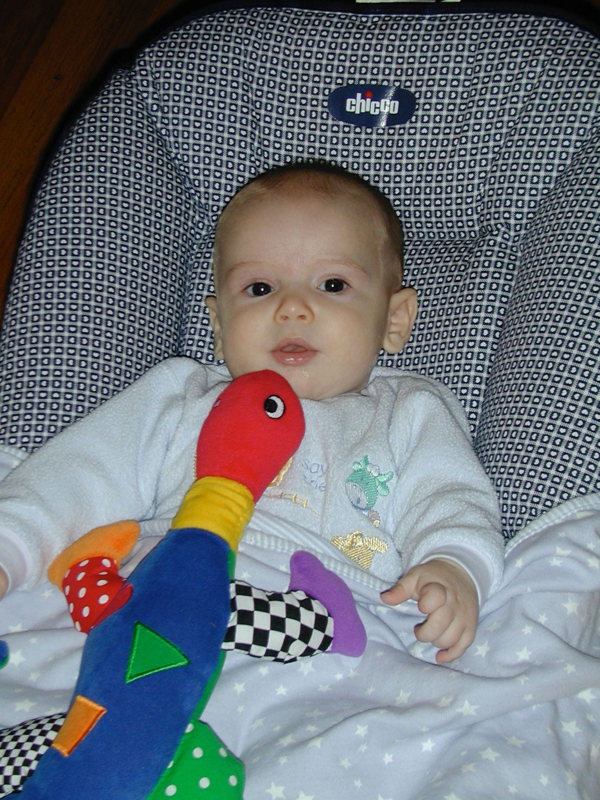

# Sam & Creatures Digital Edition

	

	

	

	

	

	

	

	

	

	

	

	

	

	

	

	

	

	

	

	

	

	

	

	

	

	

	

	

	

	

	

	

	

	

	

	

	

	

	

	

	

	

	

	

	

	

	

	

	

	

	

	

	

	

	

	

	

	

	

	

	

	

	

	

	

	

	

	

	

	

	

	

	

	

	

	

	

	

	

	

	

	

	

	

	

	

	

	

	

	

	

	

	

	

	

	

	

	

	

	

	

	

